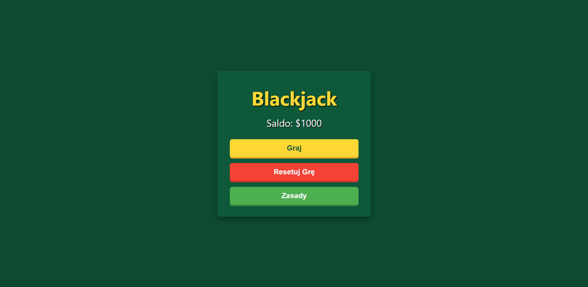
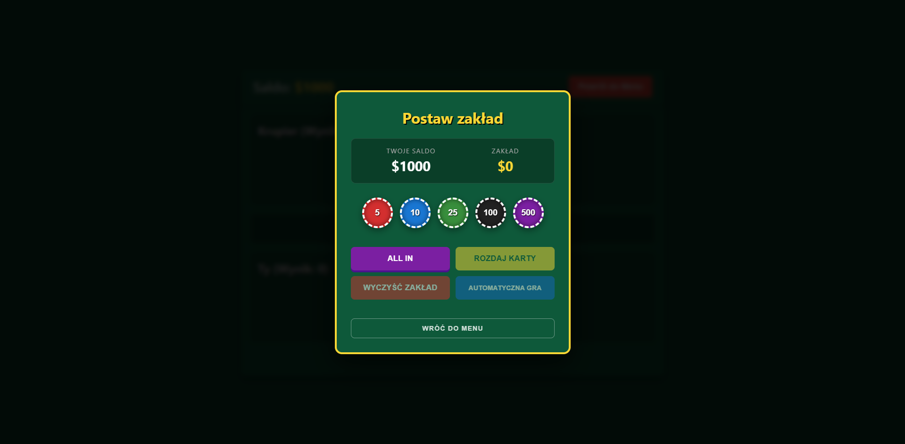
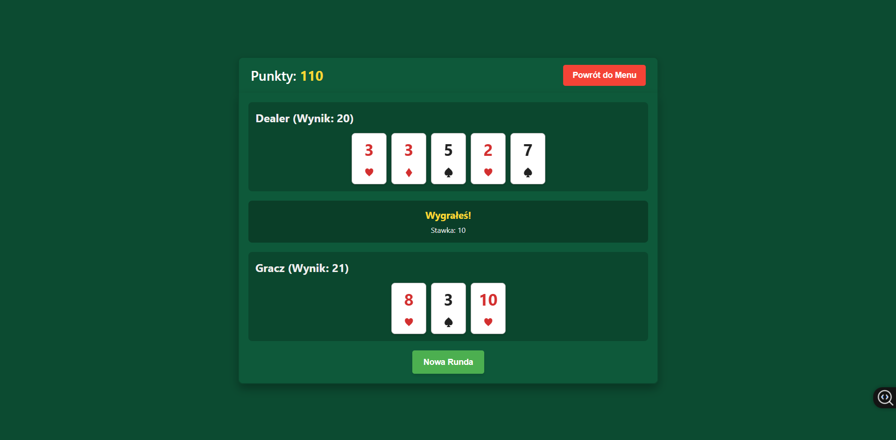

# ♠️♥️ BlackJack ♦️♣️

## Menu Gry

## Rozpoczęcie gry

## Przykładowa rozgrywka

## Opis projektu  
„Blackjack” to prosta przeglądarkowa gra karciana inspirowana klasycznym kasynowym tytułem. Celem gry jest osiągnięcie sumy 21 lub jak najbliżej niej bez przekroczenia tej liczby. Gra oferuje zarówno rozgrywkę manualną, jak i tryb automatyczny sterowany przez bota.

<a href="https://blackjack-ten-bice.vercel.app" target="_blank" rel="noopener noreferrer">
  <strong>KLIKNIJ ŻEBY ZAGRAĆ</strong>
</a>

## Funkcje

- **Rozbudowana mechanika:** Obsługa Hit, Stand, Double Down (Podwojenie) oraz Ubezpieczenia.
- **Automatyczna Gra (Bot):** Możliwość włączenia bota, który gra za użytkownika według optymalnej strategii matematycznej.
- **Logika Krupiera:** Automatyczne dobieranie kart przez krupiera do momentu uzyskania minimum 17 punktów.
- **System Zakładów:** Obstawianie żetonami, opcja "All In" oraz zarządzanie saldem.
- **Przejrzysty interfejs:** Responsywny design w HTML/CSS/React.

## Zasady i Przebieg Gry

### 1. Wartości Kart
- **2-10:** Zgodnie z liczbą na karcie.
- **Walet (J), Dama (Q), Król (K):** 10 punktów.
- **As (A):** 1 lub 11 punktów (wartość korzystniejsza dla gracza).

### 2. Przebieg Rozgrywki

#### Krok 1: Obstawianie
Wybierz żetony, zagraj **ALL IN** (wszystko) lub wyczyść zakład.  
*Opcja dodatkowa:* Możesz włączyć **Automatyczną Grę**, gdzie bot podejmuje decyzje za Ciebie.

#### Krok 2: Rozdanie
Ty i krupier otrzymujecie po dwie karty. Jedna z kart krupiera pozostaje zakryta do końca Twojej tury.

#### Krok 3: Twoje Decyzje
W swojej turze możesz wykonać następujące ruchy:
- **Hit (Dobierz):** Bierzesz kolejną kartę.
- **Stand (Pasuj):** Kończysz turę z obecnym wynikiem.
- **Double (Podwój):** Podwajasz stawkę, dobierasz **tylko jedną** kartę i kończysz turę (dostępne tylko przy dwóch pierwszych kartach).
- **Ubezpieczenie:** Gdy odkrytą kartą krupiera jest As, możesz postawić połowę stawki, że krupier ma Blackjacka. Jeśli trafisz (krupier ma 21), wygrywasz 2:1 z ubezpieczenia.

#### Krok 4: Tura Krupiera
Krupier odkrywa swoją kartę i musi dobierać karty, dopóki ma mniej niż **17 punktów**.

### 3. Wynik i Wypłaty

| Wynik | Opis | Wypłata |
| :--- | :--- | :--- |
| **Blackjack** | As + 10/J/Q/K w dwóch pierwszych kartach. | Zwrot stawki + **150%** wygranej |
| **Wygrana** | Masz więcej punktów niż krupier (max 21). | Zwrot stawki + **100%** wygranej |
| **Remis (Push)** | Masz tyle samo punktów co krupier. | **Zwrot stawki** |
| **Przegrana** | Przekroczyłeś 21 pkt lub masz mniej niż krupier. | **Utrata stawki** |